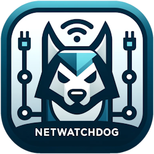

# Netwatchdog


[](./LICENSE)
[](https://github.com/viperman1271/Netwatchdog/actions/workflows/cmake-multi-platform.yml)

## Table of Contents
  - [Table of Contents](#table-of-contents)
  - [Introduction](#introduction)
  - [Build](#build)  
    - [Using Existing vcpkg](#using-existing-vcpkg)
      - [Windows](#windows)
      - [Linux](#linux)      
    - [New Installation of vcpkg](#new-installation-of-vcpkg)
      - [Windows](#windows-1)
      - [Linux](#linux-1)
    - [Docker](#docker)
  - [Usage](#usage)  
    - [Server](#server)  
    - [Client](#client)  
  - [Contribute](#contribute)
  - [License](#license)
  - [Dependencies](#dependencies)

## Introduction

Netwatchdog is a simple application that is used to monitor network connection drops.

## Build

Netwatchdog uses CMake to generate necessary configuration files. As a prerequisite, python must be available on the system first.

If you're already using vcpkg, you can use the existing installation or create a new one.

### Using Existing vcpkg

#### Windows

```
cmake -B build -DCMAKE_BUILD_TYPE=Release -DCMAKE_TOOLCHAIN_FILE=%VCPKG_ROOT%/scripts/buildsystems/vcpkg.cmake -S .
cmake --build build --config Release
```

#### Linux
```
cmake -B build -DCMAKE_BUILD_TYPE=Release -DCMAKE_TOOLCHAIN_FILE=$VCPKG_ROOT/scripts/buildsystems/vcpkg.cmake -S .
cmake --build build --config Release
```

### New Installation of vcpkg

#### Windows

```
git clone https://github.com/microsoft/vcpkg.git
./vcpkg/bootstrap-vcpkg.bat

cmake -B build -DCMAKE_BUILD_TYPE=Release -DCMAKE_TOOLCHAIN_FILE=./vcpkg/scripts/buildsystems/vcpkg.cmake -S .
cmake --build build --config Release
```

#### Linux
```
git clone https://github.com/microsoft/vcpkg.git
./vcpkg/bootstrap-vcpkg.sh

cmake -B build -DCMAKE_BUILD_TYPE=Release -DCMAKE_TOOLCHAIN_FILE=./vcpkg/scripts/buildsystems/vcpkg.cmake -S .
cmake --build build --config Release
```

### Docker

To build docker images, please see docker [README.md](docker/README.md)

## Usage

The usage of the client and the server is quite simple. Running the application is enough to use the default settings.

- [Netwatchdog Monitoring Server](https://hub.docker.com/r/viperman1271/netwatchdog-server)
- [Netwatchdog Monitoring Client](https://hub.docker.com/r/viperman1271/netwatchdog-client)
- [Netwatchdog Webserver](https://hub.docker.com/r/viperman1271/netwatchdog-web)

### Server

The MongoDB can be configured through 3 options - via environment variables, command line options, or values in the config.toml. Any values passed as command line, or via environment variables, will not be saved in the config.toml for security reasons.

| Variable | Description |
| -------- | ----------- |
| MONGO_USERNAME | Username for credentials |
| MONGO_PASSWORD | Password for credentials |
| MONGO_HOST | Hostname of the database (defaults to localhost) |
| MONGO_PORT | Port for the database (defaults to 27017) |

```
NetWatchdog - ZeroMQ based network monitoring tool.
Usage: C:\git\NetWatchdog\bin\Debug\netwatchdogd.exe [OPTIONS]

Options:
  -h,--help                   Print this help message and exit
  -p,--port INT               The port to use [defaults to 32000]
  -i,--identity TEXT          Identity
  --host TEXT                 Listening address for the server [defaults to *]
  --username TEXT             Username for database access [defaults to root]
  --password TEXT             Password for database access
  --db_host TEXT              Database host address
  --db_port INT               Database port [defaults to 27017]
```

### Client

```
NetWatchdog - ZeroMQ based network monitoring tool.
Usage: C:\git\NetWatchdog\bin\Debug\netwatchdogc.exe [OPTIONS]

Options:
  -h,--help                   Print this help message and exit
  -p,--port INT               The port to use [defaults to 32000]
  -i,--identity TEXT          Identity
  -c,--clientCount UINT       Number of clients to spawn.
  --host TEXT                 Host to connect to
```

## License

Netwatchdog is licensed under the [MIT license](https://opensource.org/license/mit)

## Dependencies

- [Cereal](https://uscilab.github.io/cereal/)
- [CLI11](https://cliutils.github.io/CLI11/book/)
- [cpp-httplib](https://github.com/yhirose/cpp-httplib)
- [cppzmq](https://zeromq.org/)
- [MongoDB](https://www.mongodb.com/)
- [stduuid](https://github.com/mariusbancila/stduuid)
- [TOML11](https://queue.cppget.org/toml11)
